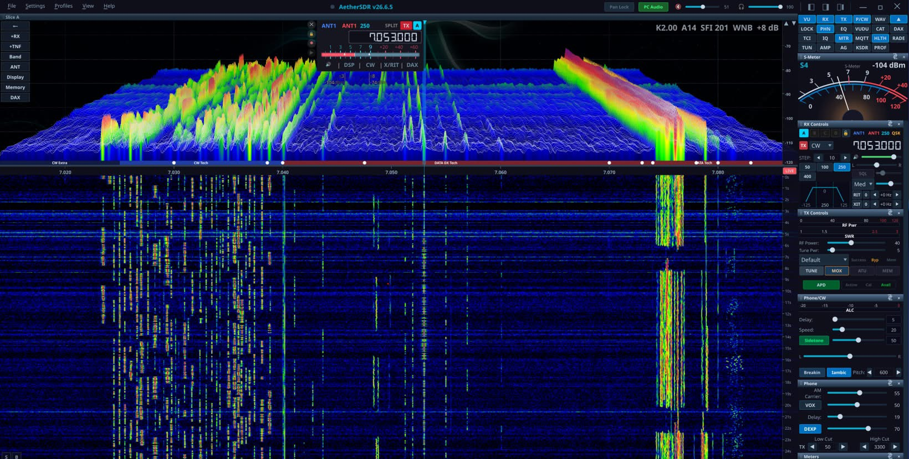

# AetherSDR

**A cross-platform, open-source client for FlexRadio Systems transceivers**

[](https://github.com/aethersdr/AetherSDR/actions/workflows/ci.yml)
[](https://www.gnu.org/licenses/gpl-3.0)
[](https://en.cppreference.com/w/cpp/20)
[](https://www.qt.io/)
[](https://github.com/aethersdr/AetherSDR/commits/main)

AetherSDR brings full FlexRadio operation to Linux, macOS, and Windows — each a native build, no Wine or virtual machines. A native aarch64 build also runs on Raspberry Pi and other embedded ARM devices. Built from the ground up with Qt6 and C++20, it speaks the SmartSDR protocol natively and aims to replicate the full SmartSDR experience.

**Current version: 26.7.3** — CalVer (`YY.M.patch[.hotfix]`). | [Download](https://github.com/aethersdr/AetherSDR/releases/latest) | [Discussions](https://github.com/aethersdr/AetherSDR/discussions) | [What's New](https://github.com/aethersdr/AetherSDR/releases)

> **Native builds for Linux, macOS, and Windows** — Linux AppImage (x86-64 + aarch64), macOS DMG (Apple Silicon + Intel), Windows installer and portable ZIP. Every platform is built, tested in CI, and released together.



<p><i>Native. Open. Yours.</i></p>

---

## Highlights

- **GPU-accelerated spectrum & waterfall** — QRhi rendering on the GPU (OpenGL/Metal/D3D11) with a per-pixel FFT trace at up to **60 fps**, an optional **3D stacked-trace** spectrum mode (perspective FFT history, floor-anchored ridges), ~71% CPU reduction over CPU paint, GPU-composited slice flags, and multi-GPU adapter selection
- **Multi-slice & multi-panadapter** — colour-coded VFO overlays, independent TX assignment, diversity/ESC beamforming; up to 8 detachable pans with native VITA-49 waterfall tiles, with selectable S-meter / **SmartMTR** meter views per flag
- **KiwiSDR public-receiver browser** — find and connect to public KiwiSDR receivers worldwide through an API-policy-aware directory (diversity receive with receive-only TX inhibit)
- **Aetherial Audio Channel Strip** — a unified RX **and** TX DSP suite (gate, EQ, compressor, de-esser, tube, AetherVoice exciter, reverb, brickwall limiter) with a preset library and a per-side scope
- **Six client-side noise-reduction engines** — NR2 (spectral), RN2 (RNNoise), NR4 (libspecbleach), DFNR (DeepFilterNet3), BNR (NVIDIA GPU AI — the Maxine denoiser in-process on a local NVIDIA RTX/GeForce GPU, Linux + Windows; see [`docs/nvidia-bnr.md`](docs/nvidia-bnr.md)), and MNR (macOS)
- **DAX virtual audio + IQ** — 4 RX + 1 TX channels and raw I/Q at 24–192 kHz for WSJT-X / fldigi / VARA / JS8Call, plus a per-slice **WFM demodulator** for satellite data
- **AetherModem packet radio** — KISS-over-TCP TNC, connected-mode AX.25 BBS, a personal mailbox, and an **APRS client** (station map, GPS beacon, messaging) with a Direwolf-derived VHF demodulator
- **AetherSweep** — in-panadapter SWR analyzer with log scale, threshold-band shading, and interpolated bandwidth at SWR ≤ 1.5 / 2.0
- **SpotHub** — DX Cluster, RBN, WSJT-X, POTA, and FreeDV Reporter spots with auto-mode switch
- **CW operator suite** — real-time Morse decoder, MIDI/keyboard straight-key & iambic paddles with full QSK, optional Quindar tones
- **Copy Assist (speech-to-text)** — on-device transcription of received voice via whisper.cpp, docked under the waterfall with confidence color-coding; CPU or GPU (Vulkan/Metal, auto-detected), download-on-demand models, and an optional remote OpenAI-compatible endpoint (see [`docs/asr-copy-assist.md`](docs/asr-copy-assist.md))
- **FreeDV RADE** — AI digital-voice codec with a client-side neural encoder/decoder
- **SmartLink remote + TCI v2.0 server** — Auth0/TLS WAN operation, and CAT + audio + IQ + CW + spots over a single TCI WebSocket
- **Broad hardware control** — rigctld + virtual-serial CAT, MIDI mapping, the FlexControl knob, serial PTT/CW keying, and Multi-Flex operation alongside SmartSDR/Maestro

---

## How AetherSDR Is Built

AetherSDR is developed using an AI-augmented open-source workflow:

- **Project lead (Jeremy KK7GWY) + a core contributor team** working primarily through Claude Code and a mix of AI development tools — every commit goes through the merge gate; nothing reaches `main` without human review
- **[AetherClaude](https://github.com/aethersdr/aetherclaude) orchestrator bot** auto-triages incoming issues, drafts implementation plans, and produces PRs for issues labelled `aetherclaude-eligible`
- **Contributors use a mix of AI tools** (Codex, Copilot, Cursor, Gemini, Aider) — the project's [Constitution](CONSTITUTION.md) (14 principles, structured per [Cisco's Foundry Constitution](https://github.com/CiscoDevNet/foundry-security-spec) spec) codifies the conventions every contributor and every AI tool follows
- **Branch protection enforces signed commits, CI green, and CODEOWNERS review** — every change goes through the same gate regardless of which AI tool (or human) produced it
- **At active pace: ~50 PRs per week, ~15,000–30,000 lifetime downloads, ≥6 distinct AI tools touching the codebase**

See [`AGENTS.md`](AGENTS.md) for the canonical project guide that every AI assistant reads first, and [`CONSTITUTION.md`](CONSTITUTION.md) for the principles that gate the contribution model.

The full list of code contributors is auto-generated from GitHub commit attribution — see the [Contributors graph](https://github.com/aethersdr/AetherSDR/graphs/contributors).

---

## Supported Hardware

Works with any FlexRadio transceiver, including:

- FLEX-6000 series: FLEX-6300, FLEX-6400, FLEX-6400M, FLEX-6500, FLEX-6600, FLEX-6600M, FLEX-6700
- FLEX-8000 series: FLEX-8400, FLEX-8400M, FLEX-8600, FLEX-8600M
- Aurora series: AU-510, AU-510M, AU-520, AU-520M
- ML-, CL-, and RT-series devices

Supported external devices include the 4O3A/FlexRadio PGXL (Power Genius XL)
power amplifier and TGXL (Tuner Genius XL) antenna tuner.

Active test target is FLEX-8600 firmware 4.2.18 (SmartSDR protocol v1.4.0.0);
earlier 4.x firmware works; v3.x is unsupported.

## Tested Controller Devices

AetherSDR supports external station-control hardware through USB serial, USB HID,
MIDI, Stream Deck/StreamController plugins, and generic USB-serial adapters:

- FlexRadio FlexControl USB tuning knob
- Icom RC-28 USB remote encoder
- Griffin PowerMate USB knob
- Contour ShuttleXpress and ShuttlePro v2 jog controllers
- MIDI controllers with learn mode, profiles, and relative-encoder support
- Elgato Stream Deck devices through the bundled macOS/Windows Stream Deck plugin
- Stream Deck devices on Linux through the bundled StreamController plugin
- USB-serial PTT/CW interfaces for foot switches, straight keys, iambic paddles,
  amplifier keying lines, and external sequencers

---

## Download

Pre-built binaries are available from [Releases](https://github.com/aethersdr/AetherSDR/releases/latest):

| Platform | Download | Notes |
|----------|----------|-------|
| **Linux x86_64** | `AetherSDR-*-x86_64.AppImage` | Single file, no install needed. `chmod +x` and run. |
| **Linux ARM** | `AetherSDR-*-aarch64.AppImage` | Raspberry Pi, ARM laptops. `chmod +x` and run. |
| **macOS** | `AetherSDR-*-macOS-apple-silicon.dmg` | Apple Silicon (M1+). Intel Macs via Rosetta. Signed & notarized. |
| **Windows Installer** | `AetherSDR-*-Windows-x64-setup.exe` | Setup wizard with Start Menu shortcut and uninstaller. |
| **Windows Portable** | `AetherSDR-*-Windows-x64-portable.zip` | No install needed. Extract and run. |

---

## Building from Source

### Dependencies

Install all dependencies for a full-featured build. Optional packages are noted — the build succeeds without them but the corresponding features are disabled.

```bash
# Arch / CachyOS / Manjaro
sudo pacman -S qt6-base qt6-multimedia qt6-websockets qt6-serialport \
  qt6-shadertools cmake ninja pkgconf autoconf automake libtool \
  fftw portaudio hidapi qtkeychain-qt6

# Ubuntu 24.04+ / Debian / Linux Mint
sudo apt install qt6-base-dev qt6-base-private-dev qt6-multimedia-dev \
  qt6-websockets-dev qt6-serialport-dev qt6-shader-baker qt6-shadertools-dev \
  cmake ninja-build pkg-config autoconf automake libtool \
  libfftw3-dev portaudio19-dev libhidapi-dev qtkeychain-qt6-dev \
  libxkbcommon-dev libopengl0 \
  gstreamer1.0-pulseaudio gstreamer1.0-plugins-base

# Fedora
sudo dnf install qt6-qtbase-devel qt6-qtbase-private-devel qt6-qtmultimedia-devel \
  qt6-qtwebsockets-devel qt6-qtserialport-devel qt6-qtshadertools-devel \
  cmake ninja-build autoconf automake libtool \
  fftw3-devel portaudio-devel hidapi-devel qtkeychain-qt6-devel

# macOS (Homebrew)
brew install qt@6 ninja cmake pkgconf autoconf automake libtool \
  fftw portaudio hidapi qtkeychain
```

<details>
<summary>What each dependency enables</summary>

| Package | Feature |
|---------|---------|
| qt6-base, qt6-multimedia | Core application (required) |
| qt6-base-private-dev | GPU-accelerated spectrum/waterfall (QRhi) |
| qt6-shadertools-dev | GPU shader compilation |
| qt6-websockets-dev | TCI server, FreeDV Reporter spots |
| qt6-serialport-dev | FlexControl, serial PTT/CW, MIDI controllers |
| libfftw3-dev | NR2 spectral noise reduction |
| portaudio19-dev | PortAudio audio backend |
| libhidapi-dev | USB HID encoders (RC-28, PowerMate, FlexControl) |
| qtkeychain-qt6-dev | SmartLink credential persistence |
| libopengl0 | GLVND-split desktop OpenGL runtime (GPU spectrum/waterfall) |

</details>

> **Linux Mint / Ubuntu note:** If PC audio devices show as "Dummy Output",
> install `gstreamer1.0-pulseaudio`. For PipeWire systems, also install `gstreamer1.0-pipewire`.
>
> **Ubuntu 26.04 note:** If AetherSDR fails to start with a missing
> `libOpenGL.so.0` error, install `libopengl0`.  26.04 stopped pulling it in
> by default for the desktop image; the build-deps line above includes it
> explicitly so this only bites users who install just the AppImage.

### Build & Run

```bash
git clone https://github.com/aethersdr/AetherSDR.git
cd AetherSDR
cmake -B build -G Ninja -DCMAKE_BUILD_TYPE=RelWithDebInfo
cmake --build build -j$(nproc)
./build/AetherSDR
```

RADE-enabled builds use a vendored Opus snapshot, so no additional Opus download
is required during configure or build.

### Windows 11

Prerequisites: Visual Studio 2022 (Build Tools, Community, or higher) with the
MSVC C++ workload, CMake 3.25+, Ninja, and Qt 6.7+ (`msvc2022_64`; the release
binaries ship 6.8.3 LTS).

```bat
:: 1. Activate the MSVC environment. Adjust the edition (BuildTools / Community /
::    Professional / Enterprise) to match your install; run "vswhere" if unsure.
"C:\Program Files (x86)\Microsoft Visual Studio\2022\BuildTools\VC\Auxiliary\Build\vcvars64.bat"

:: 2. Point at your Qt kit once, with forward slashes (CMake reads the path
::    literally, so backslashes would be taken as escape sequences). Change the
::    version/edition here to match your install; both steps below reuse it.
::    setup-qtkeychain.ps1 (step 4) reads QT_ROOT_DIR; on CI that variable is
::    exported by install-qt-action, so a local build has to set it explicitly
::    or the script exits with "Qt not found".
set "QT_KIT=C:/Qt/6.8.3/msvc2022_64"
set "QT_ROOT_DIR=%QT_KIT%"

:: 3. Generate the single-precision FFTW import lib (needed by NR4/libspecbleach)
powershell -File scripts\setup\setup-fftw.ps1

:: 4. Build qtkeychain (needed for QRZ/SmartLink credential persistence).
::    Downloads source and builds it against your Qt kit into third_party\qtkeychain\.
::    Skip this step and the build still succeeds, but QRZ/SmartLink passwords
::    won't be saved between runs.
powershell -File scripts\setup\setup-qtkeychain.ps1

:: 5. Configure. Ninja is required: the default Visual Studio generator is
::    multi-config (it ignores CMAKE_BUILD_TYPE) and takes a different
::    manifest-embed path. Point CMAKE_PREFIX_PATH at your Qt kit so
::    find_package(Qt6) resolves.
cmake -B build -G Ninja -DCMAKE_BUILD_TYPE=RelWithDebInfo -DCMAKE_PREFIX_PATH="%QT_KIT%"

:: 6. Build
cmake --build build --target AetherSDR
```

### Qt 6.7+ for GPU Spectrum Rendering

GPU-accelerated spectrum/waterfall rendering requires Qt 6.7 or greater. If your distribution ships with an older version (e.g., Ubuntu 24.04, Debian 12, or Mint 21–22 include Qt 6.4.2), the build system automatically disables GPU rendering and falls back to the CPU-based `QPainter` path. (Release binaries ship Qt 6.8.3 LTS; the 6.7 floor is the source-build minimum for QRhi.)

To use GPU acceleration on these systems, install Qt 6.7+ manually:

1. **Option 1: Using a PPA (Ubuntu/Mint)**
   The `kubuntu-backports` PPA may provide a newer Qt — verify the version it ships before relying on it.

2. **Option 2: Using the Qt Online Installer**
   Install Qt into your home directory (e.g., `~/Qt/6.8.3/gcc_64`). Because CMake otherwise defaults to the system-provided Qt, point it at the newer install with `-DCMAKE_PREFIX_PATH`:

   ```bash
   cmake -B build -G Ninja \
       -DCMAKE_PREFIX_PATH="$HOME/Qt/6.8.3/gcc_64" \
       -DCMAKE_BUILD_TYPE=RelWithDebInfo
   ```

   Make sure the `qtshadertools` and `qt5compat` (or equivalent) modules are selected in the Qt Online Installer along with `qtbase`.

*Note: GPU rendering also needs the private QtGui headers (`qt6-base-private-dev` on Debian-family, included by default in the Qt Online Installer).*

### Install (optional, Linux)

```bash
sudo cmake --install build
```

---

## Roadmap

Currently in flight:

- **aetherd** — a vendor-neutral `IRadioBackend` seam so radio-family logic
  lives behind a stable interface (the groundwork for non-Flex radios).
- **Hermes-Lite 2** — a first non-Flex, raw-IQ backend on that seam
  (design spike in [`prototypes/hl2/`](prototypes/hl2/)).
- **AppSettings nested-JSON refactor**, **TX DSP chain visual rebuild**, and
  the **Flathub submission**.

See [`ROADMAP.md`](ROADMAP.md) for the full picture and the community backlog,
and the [issue tracker](https://github.com/aethersdr/AetherSDR/issues) for
everything else.

---

## Contributing

PRs, bug reports, and feature requests welcome! See [CONTRIBUTING.md](CONTRIBUTING.md) for guidelines.

**Development environment:** AetherSDR is developed using [Claude Code](https://claude.com/claude-code) as the primary development tool. We encourage contributors to use Claude Code for consistency. PRs must follow project conventions, pass CI, and include GPG-signed commits.

**Not a developer?** Click the lightbulb button in AetherSDR's title bar to create an AI-assisted bug report or feature request.

---

## Related projects

- **[Aether-gate](https://github.com/aethersdr/Aether-gate)** — put *any* radio into
  AetherSDR. A bridge that presents an Icom/Kenwood/Yaesu/Elecraft CAT rig (via
  [Hamlib](https://hamlib.github.io/)), an Icom LAN rig, or a SoapySDR dongle to
  AetherSDR as if it were a FlexRadio — live panadapter, waterfall, and
  frequency/mode control. Receive + control today (no transmit yet). By Nigel
  Fenton (G0JKN); GPL-3.0-or-later. *(`aethersdr/Aether-gate` tracks upstream
  [nigelfenton/Aether-gate](https://github.com/nigelfenton/Aether-gate).)*

AetherSDR integrates radios that earn deep native support directly in-engine; the
gate covers the long tail of legacy/CAT radios and dongles.

---

## Verifying Downloads

Linux and Windows binaries are GPG-signed. macOS artifacts are Apple notarized. Each release includes `.asc` signatures and `SHA256SUMS.txt`.

```bash
curl -sSL https://raw.githubusercontent.com/aethersdr/AetherSDR/main/docs/RELEASE-SIGNING-KEY.pub.asc | gpg --import
gpg --verify AetherSDR-vX.Y.Z-x86_64.AppImage.asc AetherSDR-vX.Y.Z-x86_64.AppImage
```

See [docs/VERIFYING-RELEASES.md](docs/VERIFYING-RELEASES.md) for full instructions.

---

## License

AetherSDR is free and open-source software licensed under the [GNU General Public License v3](LICENSE).

Bundled third-party libraries retain their own licenses (see each `third_party/<lib>/LICENSE`), all GPLv3-compatible. Notably, on-device speech-to-text uses **[whisper.cpp](https://github.com/ggml-org/whisper.cpp) and ggml** (MIT) — vendored under `third_party/whisper.cpp/` (Vulkan/Metal GPU backends included); Whisper model weights are downloaded on demand and are MIT-licensed, not redistributed in this repository.

*AetherSDR is an independent project and is not affiliated with or endorsed by FlexRadio Systems.*
*D-STAR is a registered trademark of Icom Inc. AetherSDR is not affiliated with or endorsed by Icom Inc.*
